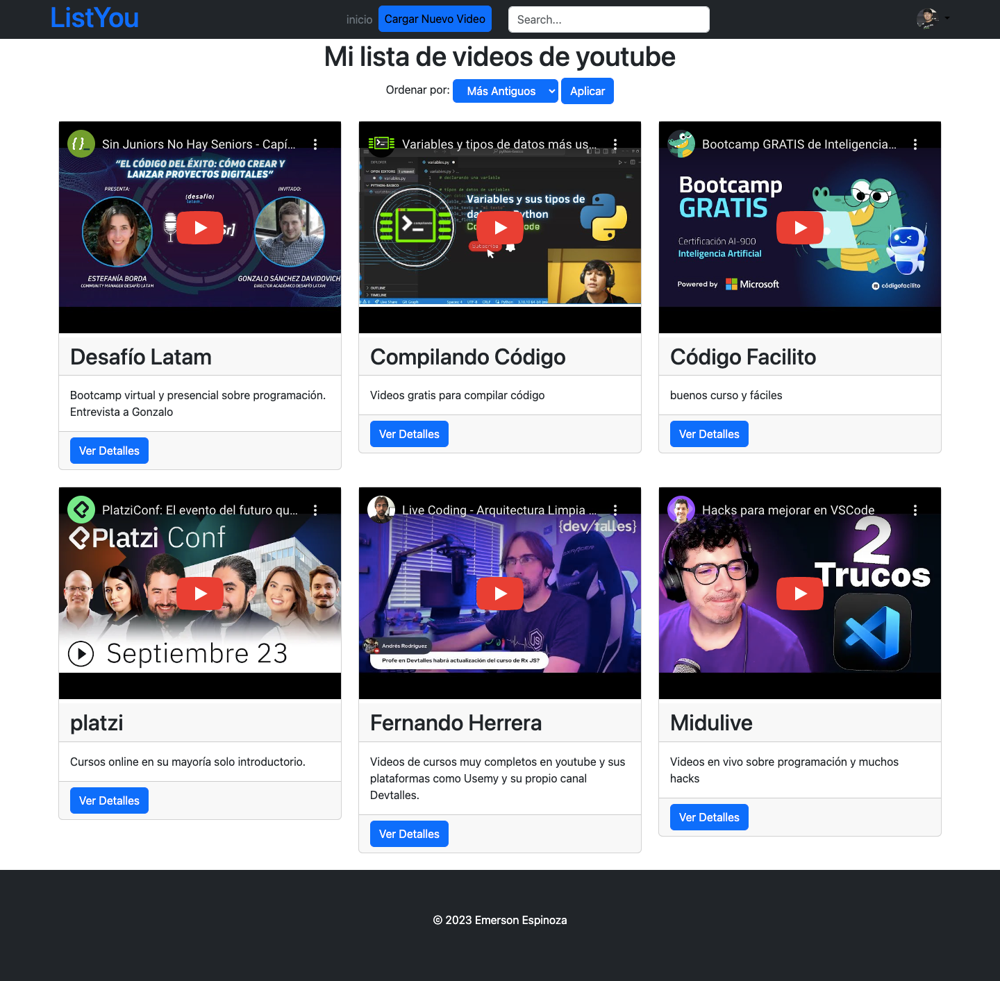

# un programa para guardar tus videos de youtube

## link demo pero solo estatico - muy pronto conectado 
<a href="https://almacen-de-videos-youtube.vercel.app/">https://almacen-de-videos-youtube.vercel.app/ </a>

## usuario y admin para iniciar sesión 
<h4> usuario: <strong style=" font-size:20px " > yudi </strong> </h4>
<h4> contraseña: <strong style=" font-size:20px "> 123456 </strong> </h4>

mini_youtube/
├── instance/
├   ├── videos.db
├── migrations/
├   ├── todas las migraciones que genera la base de datos
├── static/
├   ├── css/
├   ├   ├── style.css
├   ├── img/
├   ├   ├── todas imagenes
├   ├── js/
├   ├   ├── main.js
├── templates/ 
├   ├── shared/
├   ├   ├── footer.html
├   ├   ├── nav.html
├   ├── base.html
├   ├── index.html
├   ├── y mas archivos
├── venv/ 
├── app.py

