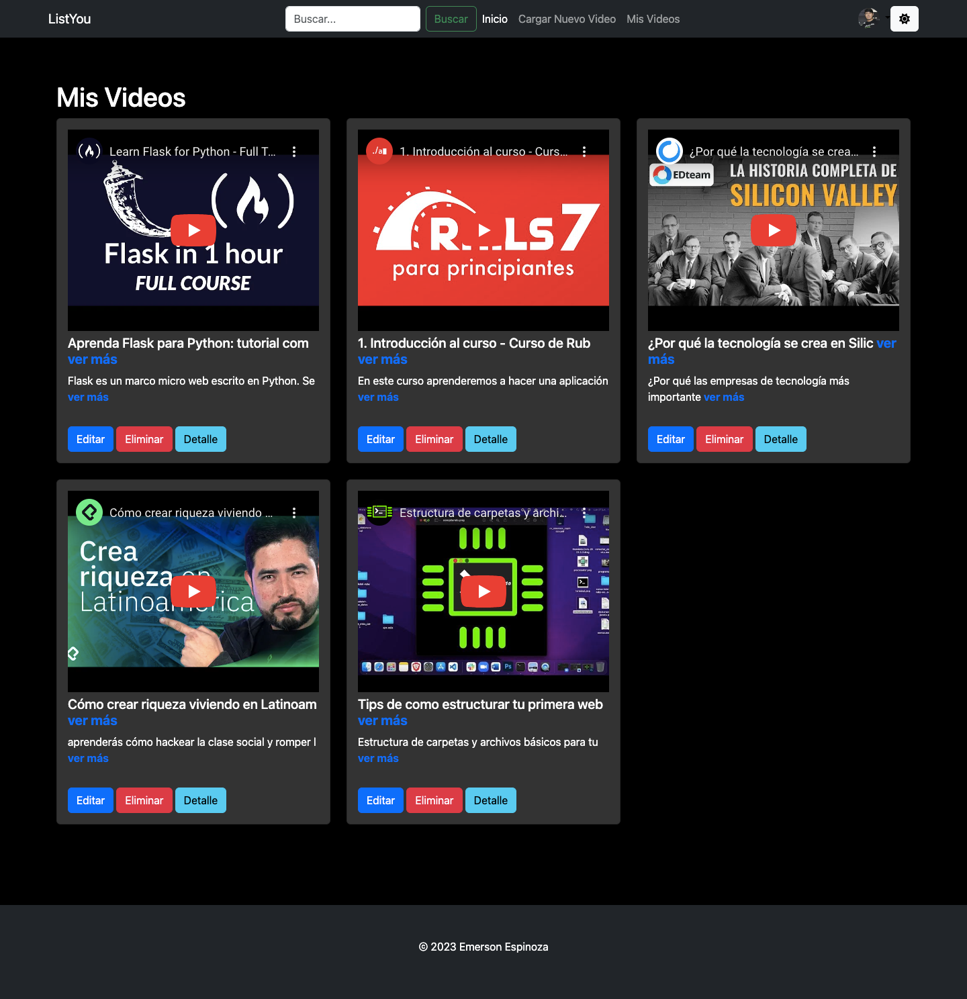
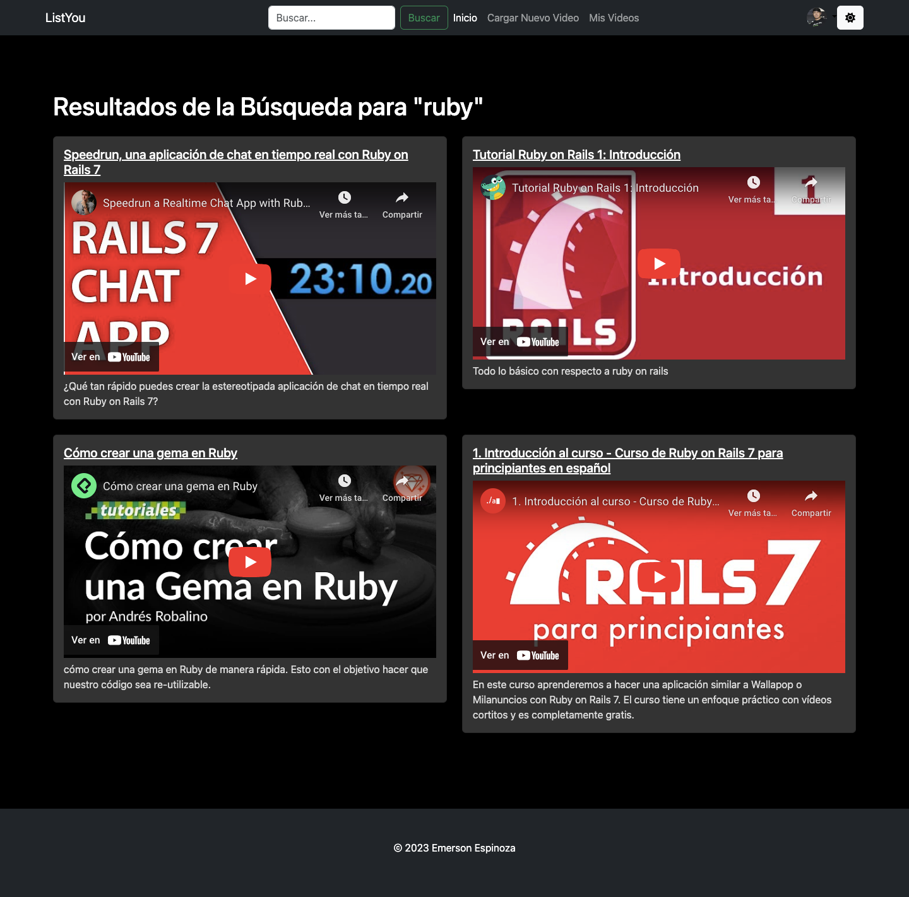

# un programa para guardar tus videos de youtube

## link demo pero solo estatico - muy pronto conectado 
<a href="https://almacen-de-videos-youtube.vercel.app/">https://almacen-de-videos-youtube.vercel.app/ </a>

## usuario y admin para iniciar sesión 
<h4> usuario: <strong style=" font-size:20px " > yudi </strong> </h4>
<h4> contraseña: <strong style=" font-size:20px "> 123456 </strong> </h4>

version 1.0


version 2.0 





## Para correr en docker 
### para crear la imagen
```bash
docker build -t mini_youtube .
```
### para correr el proyecto 
```bash
docker run -p 8080:80 mini_youtube
```
### para abrir su modo terminal de docker desde nuestra terminal
```bash
docker run -it --rm mini_youtube /bin/bash
```


